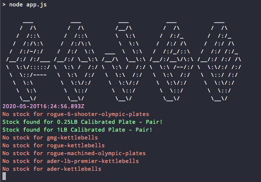

# Rouge scraper
Web scraper that checks Rogue Fitness stock of 35-55lb plates every minute. Their `Notify Me` button is delayed (I never got an email when they had stock come in), so this gets you to the front of the line for new inventory. Either check console output or wait for an in stock notification (MacOS native and Slack for mobile).



## Install
`npm i`

## Usage
edit [./items.consts.js](./items.consts.js) `url`s and `wantedItems` to match the exact product names  
`touch .env` and paste in your `SLACK_WEBHOOK_URL=XXX` for mobile notifications
`npm run start`

## Test
`npm run test`

## Run on a sever
Purchase a [Vultr sever](https://www.vultr.com/?ref=7242522) or similar  
`Cloud Compute`, any US location, `CentOS`, `$3.50/mo` or `$5/mo` option  
```bash
ssh root@xx.xx.xxx.xxx
sudo yum install git
sudo yum install epel-release
sudo yum install nodejs
git clone https://github.com/valmassoi/rouge-scraper.git
cd rouge-scraper
npm i
echo SLACK_WEBHOOK_URL=https://hooks.slack.com/services/xxx/xxx/xxx > .env
npm i forever -g # run process in the background
forever start app.js 
forever logs
cat /root/.forever/xxx.log # make sure everything looks good, should get a slack notification
# exit and get ready to buy!
```
